# System Architecture Diagrams (Mermaid)

## High-Level Architecture

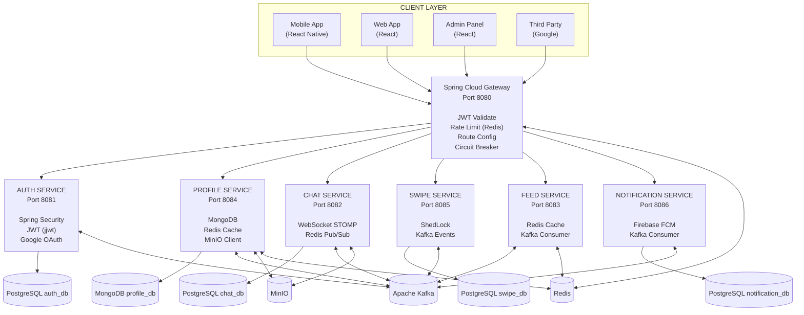

## Event-Driven Communication

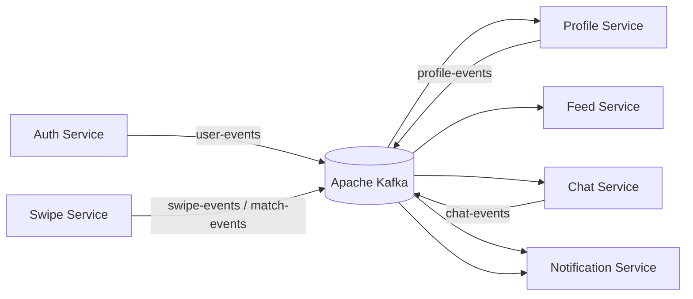

## User Registration Flow

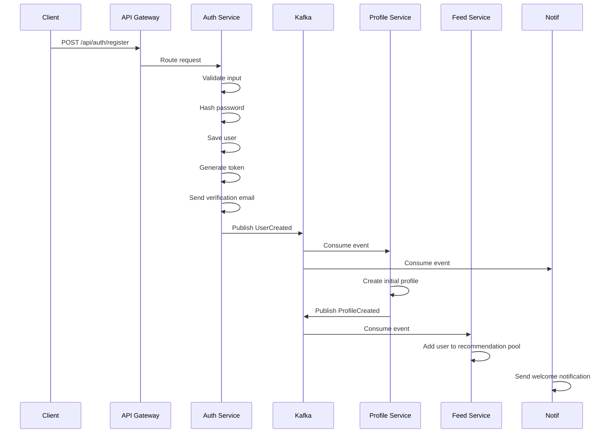

## Match Flow

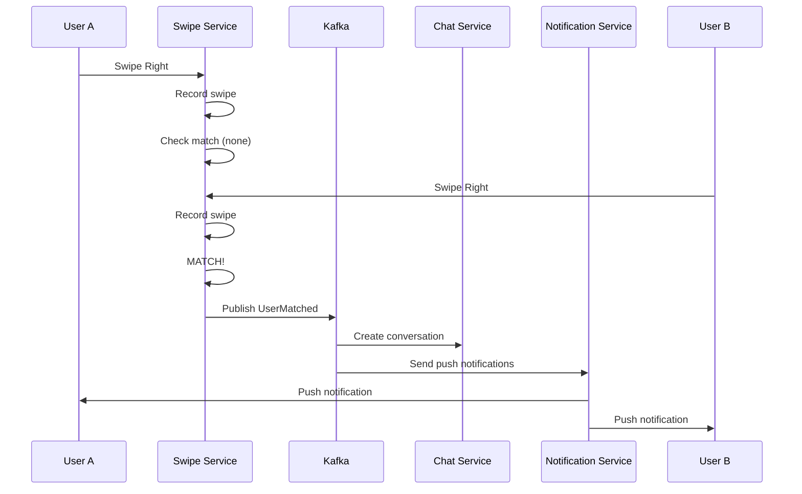

## Chat Flow

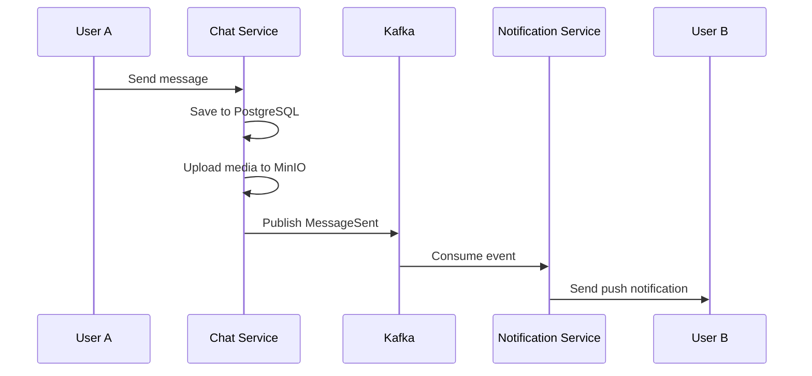

## Security Flow

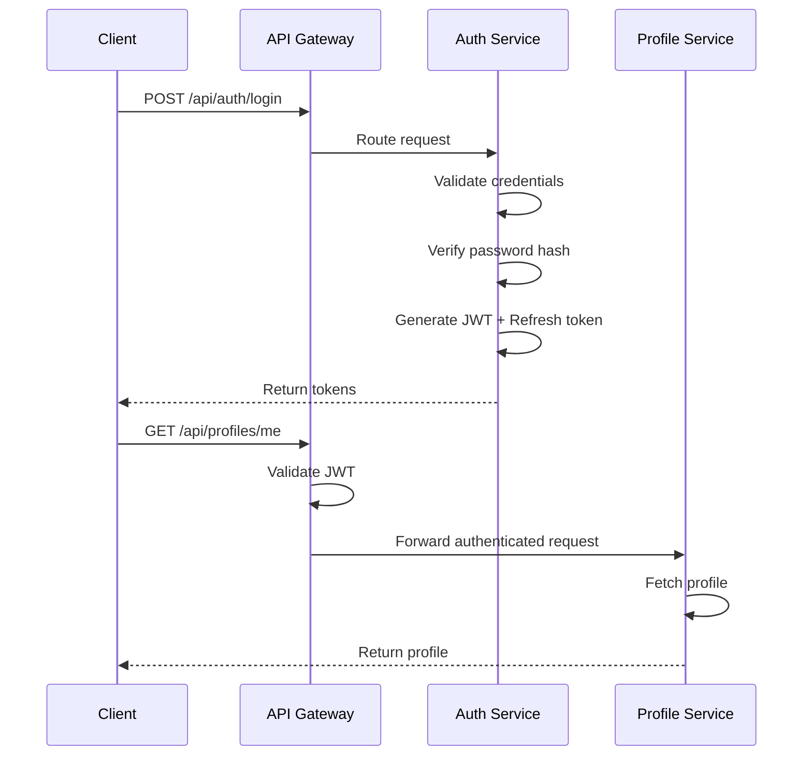

## Caching Flow

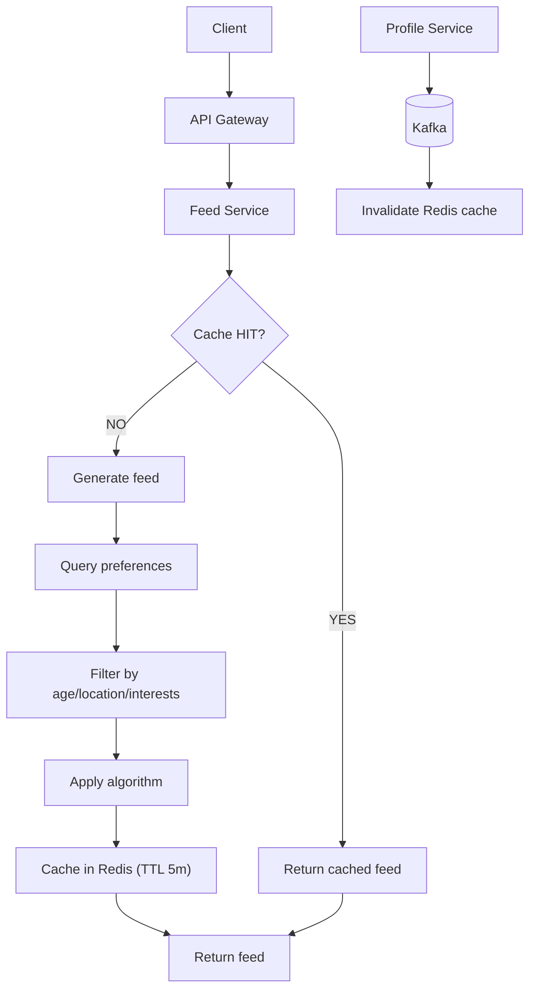

## Deployment Architecture

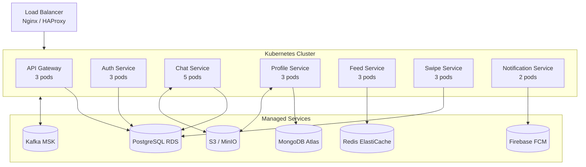

## Service Dependencies

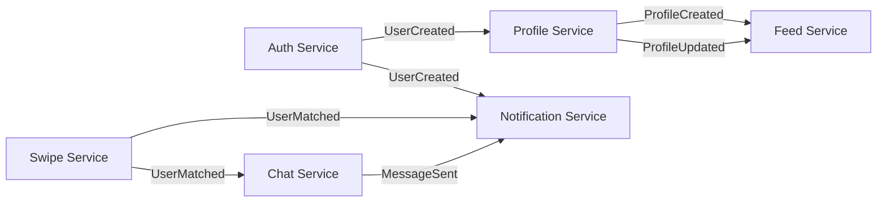

## WebSocket Horizontal Scaling

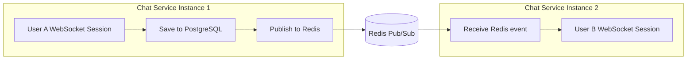

## Port Mapping

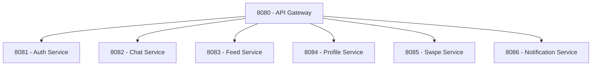
